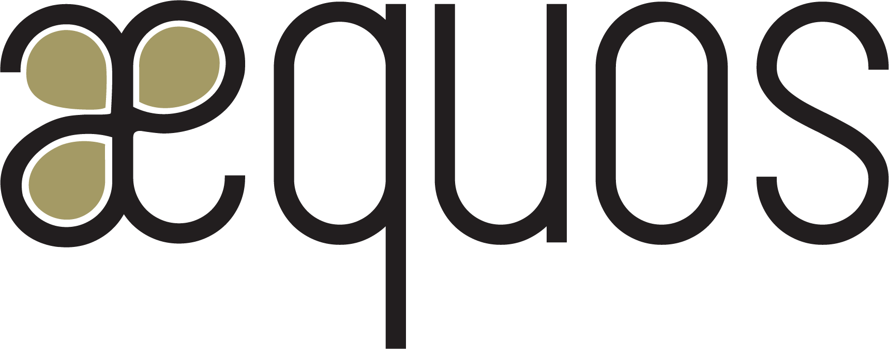

### æquos - Reusable SharePoint Online Extensions ###

  

## Description ##

This repository contains all reusable SharePoint extensions that we use to build our solutions within SharePoint in Office 365.

## Samples list ## 

Current available web parts:

Name | Description
-------|--------|
react-msal-bot | How to integrate a bot within a SharePoint Online portal supporting authentication to access Azure AD protected APIs like Microsoft graph resources using MSAL.